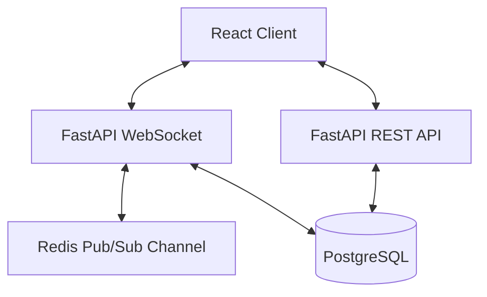

# Scalable Real-Time Chat (FastAPI Backend)

A production-grade, highly scalable chat application backend shifted from Node.js to **FastAPI**. It leverages WebSockets for real-time messaging, Redis Pub/Sub for horizontal scaling across multiple instances, and PostgreSQL for persistent data storage.

## 🚀 Tech Stack
- **Framework**: FastAPI (Python 3.11+)
- **Database**: PostgreSQL with SQLAlchemy (Async)
- **Real-time**: WebSockets + Redis Pub/Sub
- **Containerization**: Docker & Docker Compose

## 🏗 Architecture


## 🛠 Setup & Run Instructions

### Using Docker Compose (Recommended)
You can spawn the entire ecosystem (FastAPI Backend, PostgreSQL DB, and Redis) using Docker.

1. Clone the repository and navigate to the project root.
2. Build and spin up the containers:
   ```bash
   docker-compose up --build -d
   ```
3. The FastAPI app will be available at `http://localhost:8000`.
   - Swagger Documentation: `http://localhost:8000/docs`

### Manual Setup
1. Setup a Python virtual environment: `python3 -m venv venv && source venv/bin/activate`
2. Install dependencies: `pip install -r backend/requirements.txt`
3. Configure your `.env` file (see `.env.example`).
4. Start the server:
   ```bash
   cd backend && uvicorn main:app --reload
   ```

## 📡 API Endpoints (REST & WS)
- **REST APIs**: 
  - `POST /api/users` (Create User)
  - `GET /api/rooms` (List Rooms)
  - `POST /api/rooms` (Create Room)
  - `GET /api/messages/{room_id}` (Chat History)
- **WebSocket Route**: `ws://localhost:8000/ws/chat/{room_name}?username={username}`

## 🤝 Contributing
Open issues and PRs on the repository. Do not commit secrets.